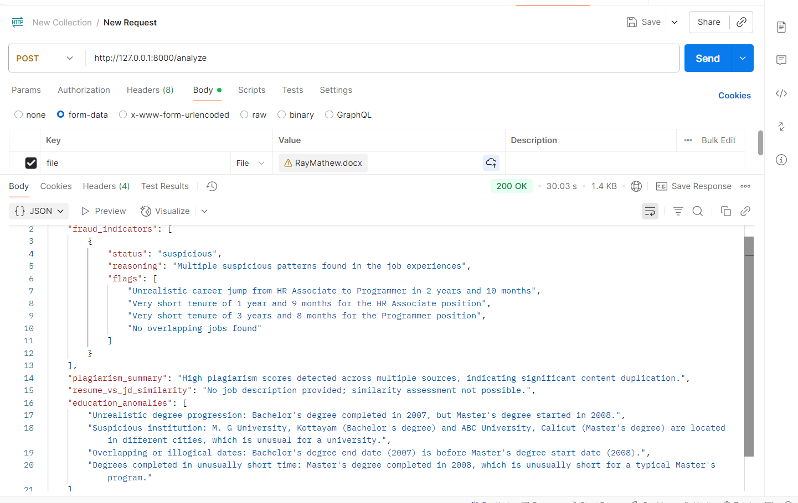

# Fraudulent Candidate Detection Tool

## 1. Introduction
The Fraudulent Candidate Detection Tool is designed to identify and flag potentially fraudulent resumes and candidates during the recruitment process. The system leverages Natural Language Processing (NLP), AI, and Information Retrieval (IR) techniques to analyze resumes, detect inconsistencies, and highlight suspicious patterns for HR teams.

## 2. Objectives
- Detect fake or inflated work experience.
- Identify inconsistencies in educational background.
- Compare candidate skills with stated experience.
- Detect plagiarism or copied content in resumes.
- Provide actionable insights for HR teams with recommendations.

## 3. System Architecture
The tool follows a modular architecture with the following key components:

1. Frontend (React/Next.js): Provides an intuitive interface for HR users to upload resumes and view results.
2. Backend (FastAPI): Handles resume parsing, fraud detection logic, and API endpoints.
3. Resume Parser (LLM-powered): Extracts structured data from resumes including education, work experience, skills, and personal details.
4. Fraud Analyzer: Detects suspicious patterns such as overlapping dates, inconsistent education, and inflated job roles.
5. Plagiarism Detector (Pinecone + Embeddings): Checks similarity of resumes against stored data to detect copied content using hybrid methods.
6. Vector Database (Pinecone): Stores embeddings for plagiarism detection.
7. Logging & Monitoring: Tracks system performance and anomalies.

## 4. System Components

### 4.1 Resume Parsing (LLM-based) Module
**ResumeParserLLM**  
- Extracts structured data from resumes (PDF, DOCX, TXT).  
- Uses Groq LLM (LLaMA models) with strict schema enforcement.  
- Handles fields: Name, Email, Phone, Skills, Education, Experience.  
- Falls back to empty schema on invalid parsing.

### 4.2 Experience Validation Module
**FraudAnalyzerAI**  
- Validates candidate’s career progression. Checks for:  
  - Unrealistic career jumps (e.g., Intern → Manager in 6 months)  
  - Very short tenures (<3 months)  
  - Overlapping job roles  

### 4.3 Education Validation Module
**AIEducationValidator**  
- Detects anomalies in academic background:  
  - Fake institutions  
  - Unrealistic degree timelines  
  - Overlapping or illogical dates  

### 4.4 Plagiarism Detection Module
**PlagiarismDetector**  
- Uses Pinecone hybrid index (dense + sparse embeddings).  
- Compares candidate resume against stored resumes and optional Job Description (JD).  
- Detects copied resumes or overlap with JD.  

### 5. Key Features
- Automated resume parsing using NLP.  
- Fraud detection for education, experience, and skills.  
- Plagiarism detection using embeddings and vector search.  
- Actionable insights for HR teams.  
- Scalable architecture with modular components.  
- Secure data handling with authentication and encryption.

## Technologies and Tools Used

| Layer / Component                | Technology / Tool               | Purpose / Description                                                                 |
|---------------------------------|---------------------------------|-------------------------------------------------------------------------------------|
| Frontend                         | React, Next.js                  | Provides a user-friendly interface for uploading resumes and viewing reports         |
| Frontend Styling                  | CSS / Tailwind (optional)       | Styling and layout of the UI                                                       |
| Backend                          | FastAPI                         | Handles API endpoints, resume analysis, and integrates various modules             |
| Resume Parsing                    | LLaMA / Groq LLM                | Extract structured data (education, experience, skills, personal info) from resumes |
| Schema Validation                 | Pydantic                        | Enforces structured output for parsed resume data                                   |
| Experience Analysis               | FraudAnalyzerAI                 | Detects suspicious career patterns (short tenures, overlaps, unrealistic jumps)    |
| Education Analysis                | AIEducationValidator            | Detects anomalies in academic background                                           |
| Plagiarism Detection              | Pinecone (dense + sparse index) | Compares resumes against stored data and optional JD                                 |
| Resume Plagiarism Embeddings      | OpenAI Embeddings / Custom LLM  | Creates vector embeddings for similarity search                                     |
| Report Generation                 | FraudReportGenerator            | Aggregates all checks into a structured fraud report                                |
| Logging & Monitoring              | Custom Logger / Python Logging  | Tracks system performance and errors                                               |
| Environment & Secrets             | Python dotenv                   | Loads API keys and environment variables                                           |
| Deployment / Development          | Docker / Localhost / Vercel     | Containerization and deployment setup                                               |
| API Testing / Development         | Postman / curl                  | For testing API endpoints locally                                                  |
| CORS & Security                   | FastAPI Middleware              | Allows cross-origin requests from frontend                                         |

